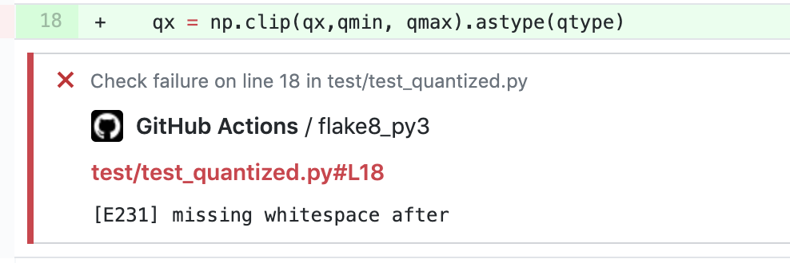

# `flake8` Github Action

This is a Github Action to run `flake8` against your repository. It uses the new Github Actions API and JavaScript toolkit. It does fancy things like add annotations to your PRs inline.



Use it in your project like:

(in `.github/workflows/lint.yml`)
```
name: Lint

on:
  push:
    paths:
      - '*.py'

jobs:
  flake8_py3:
    runs-on: ubuntu-latest
    steps:
      - name: Setup Python
        uses: actions/setup-python@v1
        with:
          python-version: 3.7.6
          architecture: x64
      - name: Checkout PyTorch
        uses: actions/checkout@master
      - name: Install flake8
        run: pip install flake8
      - name: Run flake8
        uses: suo/flake8-github-action@releases/v1
        with:
          checkName: 'flake8_py3'   # NOTE: this needs to be the same as the job name
        env:
          GITHUB_TOKEN: ${{ secrets.GITHUB_TOKEN }}
```
